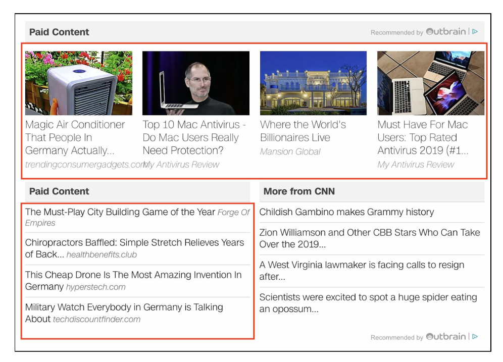

# Automation Test Task

To use this program please do the following:

1. Install: `npm install`
2. Run: `node index.js`

ATTENTION! This is an archive, which might not work properly without updating the source and packages. The last working version was checked in February 2020.

The idea is to show how it was done earlier.

## Task description

The following test task is meant to show the technical understanding and tangible workflow of a new Filter/Automation Engineer.

### Timeframe

With good Node.js skills and previous experience with Puppeteer, this case study should take
no longer than 2 to 3 hours.

Tech stack

* Node.js script
* Puppeteer
* Chrome with Adblock Plus installed

### Task

The task covers the automated capturing of specific ad units and their contained ad tiles on a
given page.

Sample URL
https://edition.cnn.com/2015/07/31/world/mh370-debris-investigation/index.html

### Instructions

1. Install ​Adblock Plus for Chrome​.
2. Manually browse to the ​sample URL​ and ensure there are ​Acceptable Ads​ units by
Outbrain in the right sidebar (3 tiles) and at the bottom of the page (4 image ad tiles
and 4 text ad tiles; see screenshot below). 
3. Download Adblock Plus inside of Puppeteer, ​here​ and extract the file into a folder
named ​abp_chrome. ​Puppeteer only supports unpacked extensions that need to be
passed via configuration options (details below).
Note​: If issues occur with the provided ZIP, Adblock Plus can be installed in Chrome
and the extension folder of ABP can be copied to the project instead.
4. Write a Node.js script that uses Puppeteer (version 1.x) to do the following:
   1. Create a Puppeteer browser instance with Adblock Plus enabled (use the
above-created directory, ​abp_chrome, ​and the configuration from the ​docs​).
   2. Wait 5 seconds for Adblock Plus to initialize and download all needed filter lists.
   3. Browse to the ​sample URL​ with a viewport of width and height set to 1200px.
   4. Scroll to the ​footer​ element at the bottom of the page.
   5. Save the bounding rectangles (x, y, width, height) of all ad tiles (the above
mentioned 7 image tiles + 4 text tiles) to a JSON file.
Hint​: Analyze the ​onmousedown​ event of the ad unit tiles and the URLs being
used there to find a generic CSS selector that exactly matches the ad tiles.
   6. Screenshot the entire page.
Note​: Timeouts have to be added to the script as needed so that ads are fully
loaded. The resulting screenshot must show all 11 ad tiles and the bounding
boxes in the file need to match the positions of the ads in the screenshot!
5. Set the project up according to how you would start a new project on your own.
